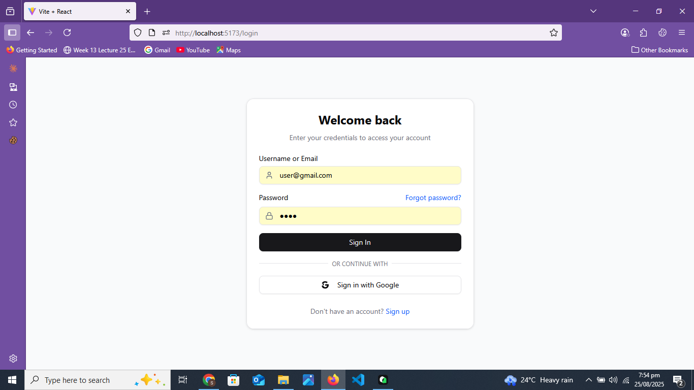

# 💬 Real-Time Chat Application

A full-stack real-time chat application built with the MERN stack, featuring Socket.IO for instant messaging, JWT authentication, and Google OAuth integration.

## 📸 Application Preview

### Login Interface

*Secure authentication with email/password and Google OAuth integration*

### Chat Interface

*Real-time messaging interface with online status indicators*

### User Management

*Browse and connect with other users in the platform*

## 🚀 Key Features

### Real-Time Communication
- **Instant Messaging**: Real-time message delivery using Socket.IO
- **Online Status Tracking**: See who's online/offline in real-time
- **Unread Message Counts**: Visual indicators for new messages
- **Message Persistence**: All conversations stored in MongoDB

### Authentication & Security
- **JWT Authentication**: Secure token-based authentication
- **Google OAuth 2.0**: One-click login with Google
- **Dual Login Options**: Email/username + password or Google sign-in
- **Protected Routes**: Client-side route protection
- **Password Hashing**: Secure bcrypt password encryption

### Modern UI/UX
- **Responsive Design**: Works seamlessly on all devices
- **Component Library**: Custom UI components with Radix UI primitives
- **Loading States**: Smooth loading indicators throughout the app
- **Toast Notifications**: User-friendly feedback messages

### Professional Architecture
- **MVC Pattern**: Clean separation of concerns in backend
- **Component-Based Frontend**: Modular React components
- **State Management**: Zustand for efficient client state
- **Error Handling**: Comprehensive error handling and validation
- **API Interceptors**: Automatic token refresh and error handling

## 🛠️ Tech Stack

### Frontend
- **React 19** - Latest React with modern hooks
- **Vite** - Fast build tool and dev server
- **Tailwind CSS 4** - Utility-first CSS framework
- **Zustand** - Lightweight state management
- **Socket.IO Client** - Real-time communication
- **React Query** - Server state management
- **React Router 7** - Client-side routing
- **Radix UI** - Accessible component primitives

### Backend
- **Node.js & Express 5** - Server runtime and web framework
- **MongoDB & Mongoose** - NoSQL database and ODM
- **Socket.IO** - Real-time bidirectional communication
- **Passport.js** - Authentication middleware
- **JWT** - Stateless authentication tokens
- **bcrypt** - Password hashing
- **Winston** - Professional logging

### Development Tools
- **ESLint** - Code linting and formatting
- **Vite** - Lightning-fast development server
- **npm** - Package management

## 🏗️ Architecture Overview

```
┌─────────────────┐    ┌─────────────────┐    ┌─────────────────┐
│   React Client  │    │  Express API    │    │    MongoDB      │
│                 │◄──►│                 │◄──►│                 │
│ • Components    │    │ • Controllers   │    │ • Users         │
│ • State (Zustand)│   │ • Routes        │    │ • Messages      │
│ • Socket Client │    │ • Middleware    │    │ • Conversations │
└─────────────────┘    └─────────────────┘    └─────────────────┘
        │                       │
        └───────────────────────┘
              Socket.IO
           (Real-time Layer)
```


## 🚀 Quick Start

### Prerequisites
- Node.js (v18 or higher)
- MongoDB (local or MongoDB Atlas)
- Google OAuth credentials (optional)

### Environment Variables

Create `.env` files in both Client and Server directories:

**Server/.env**
```env
PORT=8080
MONGODB_URI=mongodb://localhost:27017/chatapp
JWT_SECRET=your_jwt_secret_key
JWT_EXPIRES_IN=7d
GOOGLE_CLIENT_ID=your_google_client_id
GOOGLE_CLIENT_SECRET=your_google_client_secret
FRONTEND_URL=http://localhost:5173
```

**Client/.env**
```env
VITE_API_URL=http://localhost:8080
VITE_GOOGLE_CLIENT_ID=your_google_client_id
```

### Installation & Setup

```bash
# Clone the repository
git clone <repository-url>
cd Chat App

# Install server dependencies
cd Server
npm install

# Install client dependencies
cd ../Client
npm install

# Start MongoDB (if running locally)
mongod

# Start the backend server
cd ../Server
npm start

# Start the frontend development server
cd ../Client
npm run dev
```

The application will be available at:
- Frontend: http://localhost:5173
- Backend API: http://localhost:8080

## 🌟 Key Technical Highlights

### Real-Time Features
- **WebSocket Management**: Efficient connection handling with user authentication
- **Presence System**: Real-time online/offline status updates
- **Message Broadcasting**: Instant message delivery to active recipients
- **Connection Recovery**: Automatic reconnection handling

### Security Implementation
- **JWT Token Management**: Secure token generation and validation
- **Route Protection**: Both client and server-side route guards
- **CORS Configuration**: Proper cross-origin resource sharing setup
- **Input Validation**: Server-side validation using express-validator


## 🎯 Future Enhancements

- [ ] File/Image sharing capabilities
- [ ] Group chat functionality
- [ ] Message encryption
- [ ] Push notifications
- [ ] Video/Voice calling
- [ ] Message reactions and replies
- [ ] User profiles and avatars

## 📄 License

This project is licensed under the MIT License.

---

**Built with ❤️ using modern web technologies**
